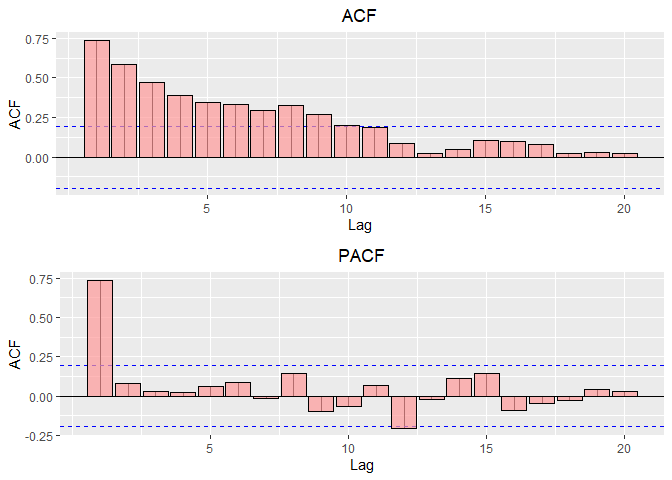
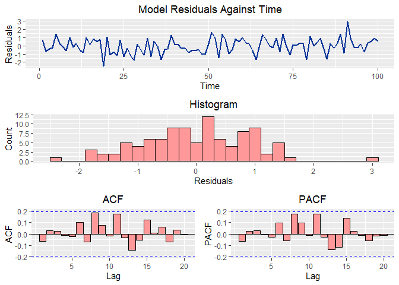

Time Series Visualization Functions R
================
William Brasic
3/15/2021

### Clear Environment and Console

``` r
rm(list=ls())
cat("\014")
```

### Set Working Directory

``` r
setwd("C:/Users/wbras/OneDrive/Desktop/GitHub/Time_Series_Visualization_Functions_R")
```

### Install and Load Necessary Packages

``` r
if (!require(tidyverse)) install.packages('tidyverse')
if (!require(tsibble)) install.packages('tsibble')
if (!require(gridExtra)) install.packages('gridExtra')
if (!require(feasts)) install.packages('feasts')
if (!require(fable)) install.packages('fable')
if (!require(fabletools)) install.packages('fabletools')
if (!require(tseries)) install.packages('tseries')
if (!require(car)) install.packages('car')
if (!require(pacman)) install.packages('pacman')

pacman::p_load(tidyverse, tsibble, fable, fabletools)
```

### Load Data and Run Simple Models

``` r
## Load Dataset only for Y1 ##
df <- read_csv('SIM_2.csv')[-3:-4]


## Convert Data to Time Series Dataframe ##
df <- tsibble(Time = 1:100, y1 = df$Y1, index = 'Time')


## AR(1) w/ Intercept ##
y1.AR1 <- df %>%
  model(ARIMA(y1 ~ 1+ pdq(1,0,0) + PDQ(0,0,0)))


## AR(2) w/ Intercept ##
y1.AR2 <- df %>%
  model(ARIMA(y1 ~ 1+ pdq(2,0,0) + PDQ(0,0,0)))
```

## Function 1

### Function for Visualizing ACF and PACF

``` r
acf.pacf.plotter <- function(dataframe, 
                             variable, 
                             title.acf = 'ACF', 
                             title.pacf = 'PACF', 
                             fill = '#FF9999') {
  
  plot.acf <- {{dataframe}} %>%
    feasts::ACF({{variable}}) %>%
    autoplot() +
    geom_bar(stat = 'identity', 
             fill = {{fill}},
             color = 'black',
             alpha = 0.7) +
    ggtitle({{title.acf}}) + 
    theme(plot.title = element_text(hjust = 0.5)) +
    xlab('Lag') + 
    ylab('ACF')
  
  plot.pacf <- {{dataframe}} %>%
    feasts::ACF({{variable}}, type = 'partial')%>%
    autoplot() +
    geom_bar(stat = 'identity', 
             fill = {{fill}},
             color = 'black',
             alpha = 0.7) +
    ggtitle({{title.pacf}}) + 
    theme(plot.title = element_text(hjust = 0.5)) +
    xlab('Lag') + 
    ylab('ACF')
  
  plot.acf.pacf <- gridExtra::grid.arrange(plot.acf, plot.pacf, nrow=2)
  
  return(plot.acf.pacf)
  
}
```

### Example of Function 1

``` r
acf.pacf.plotter(df, y1)
```

<!-- -->

## Function 2

### Function For Visualizing Model Residuals

``` r
model.residual.plotter <- function(model, 
                                   time.column.title,
                                   hist.title = 'Histogram',
                                   acf.title = 'ACF', 
                                   pacf.title = 'PACF',
                                   fill = "#FF9999"){
  
  ## Histogram of Residuals ##
  model.hist.residuals <- residuals({{model}}) %>%
    ggplot(aes(x = .resid)) + 
    geom_histogram(binwidth=0.2, color="black", fill= {{fill}}) + 
    ggtitle({{hist.title}}) + 
    theme(plot.title = element_text(hjust = 0.5)) +
    xlab('Residuals') + 
    ylab('Count')
  
  
  ## Residuals Over Time ##
  model.residuals.time <- residuals({{model}}) %>%
    ggplot() + 
    geom_line(aes(x = {{time.column.title}}, 
                  y = .resid), color = '#003399', size = 1) + 
    ggtitle('Model Residuals Against Time') + 
    theme(plot.title = element_text(hjust = 0.5)) +
    xlab('Time') + 
    ylab('Residuals')
  
  
  ## Empirical ACF for Model Residuals ##
  model.residuals.acf <- residuals({{model}}) %>%
    feasts::ACF(.resid) %>%
    autoplot() +
    geom_bar(stat = 'identity', 
             fill = {{fill}},
             color = 'black') +
    ggtitle({{acf.title}}) + 
    theme(plot.title = element_text(hjust = 0.5)) +
    xlab('Lag') + 
    ylab('ACF')
  
  
  ## Empirical PACF for Model Residuals ##
  model.residuals.pacf <- residuals({{model}}) %>%
    feasts::ACF(.resid, type = 'partial') %>%
    autoplot() +
    geom_bar(stat = 'identity', 
             fill = {{fill}},
             color = 'black') +
    ggtitle({{pacf.title}}) + 
    theme(plot.title = element_text(hjust = 0.5)) +
    xlab('Lag') + 
    ylab('PACF')

  
  ## Various Residual Plots Together ##
  all.plots <- gridExtra::grid.arrange(model.residuals.time, 
                                       model.hist.residuals,
                                       gridExtra::grid.arrange(model.residuals.acf,
                                                               model.residuals.pacf,
                                                               nrow=1), 
                                       nrow=3) 
  
  return(all.plots)
  
}
```

### Example of Function 2

``` r
model.residual.plotter(y1.AR1, time.column.title = Time)
```

<!-- -->

## Function 3

### Function For Statistical Tests of Model Residuals

``` r
residual.statistical.tests <- function(model){
  
  ## Ljung-Box Test for Autocorrelation for Lag = 8 ##
  a <- residuals(model) %>% 
    features(.resid, feasts::ljung_box, lag = 8, dof = 2)
  
  
  ## Ljung-Box Test for Autocorrelation for Lag = 16 ##
  b <- residuals(model) %>% 
    features(.resid, feasts::ljung_box, lag = 16, dof = 2)
  
  
  ## Ljung-Box Test for Autocorrelation for Lag = 24 ##
  c <- residuals(model) %>% 
    features(.resid, feasts::ljung_box, lag = 24, dof = 2)
  
  
  ## Jarque-Bera Test for Normality ##
  d <- tseries::jarque.bera.test(residuals(model)$.resid)
  
  if (grepl("ar1", deparse(substitute(model)), ignore.case = T)) {
    e <- residuals(model) %>% 
      features(.resid, car::durbinWatsonTest,  alternative = c("two.sided"))
    list.of.tests <- list(lb.lag.8 = a,
                          lb.lag.16 = b,
                          lb.lag.24 = c, 
                          dw.autocor = e, 
                          jb.normality = d)
      if(e$...1 >= 1.75 & e$...1 <= 2.25 ){
        print('Fail to Rejct Null of Zero Autocorrelation for DW Test.')
        print('No Serial Correlation Detected Amongst Residuals.')
      } else{
        print('Rejct Null of Zero Autocorrelation for DW Test.')
        print('WE HAVE A PROBLEM!')
      }
    } else {
      print('Model is NOT AR1. Hence, DW Test not Applicable')
      list.of.tests <- list(lb.lag.8 = a, 
                            lb.lag.16 = b, 
                            lb.lag.24 = c,
                            jb.normality = d)
    }
  
  
  for(i in c(a$lb_pvalue, b$lb_pvalue, c$lb_pvalue ,d$p.value)){
    print('-----------------------------------------------------------')
    if(i != d$p.value) {
      if (i > 0.05) {
        print('Fail to Reject Null of Zero Autocorrelation for One of the LB Tests.') 
        print('No Serial Correlation Detected Amongst Residuals.')
      } else {
        print('Reject Null of Zero Autocorrelation for One of the LB Tests.')
        print('WE HAVE A PROBLEM!')
      }
    }
    else if (i == d$p.value) {
      if (i > 0.05) {
        print('Fail to Reject Null of Residual Normality for JB Test.')
        print('Residuals Appear to be Normally Distributed.')
      } else {
        print('Reject Null of Residual Normality for JB Test.')
        print('WE HAVE A PROBLEM!')
      }
    }
  }
  
  print('-----------------------------------------------------------')
  
  return(list.of.tests)
}
```

### Example of Function 3 for AR(1)

``` r
residual.statistical.tests(y1.AR1)
```

    ## [1] "Fail to Rejct Null of Zero Autocorrelation for DW Test."
    ## [1] "No Serial Correlation Detected Amongst Residuals."
    ## [1] "-----------------------------------------------------------"
    ## [1] "Fail to Reject Null of Zero Autocorrelation for One of the LB Tests."
    ## [1] "No Serial Correlation Detected Amongst Residuals."
    ## [1] "-----------------------------------------------------------"
    ## [1] "Fail to Reject Null of Zero Autocorrelation for One of the LB Tests."
    ## [1] "No Serial Correlation Detected Amongst Residuals."
    ## [1] "-----------------------------------------------------------"
    ## [1] "Fail to Reject Null of Zero Autocorrelation for One of the LB Tests."
    ## [1] "No Serial Correlation Detected Amongst Residuals."
    ## [1] "-----------------------------------------------------------"
    ## [1] "Fail to Reject Null of Residual Normality for JB Test."
    ## [1] "Residuals Appear to be Normally Distributed."
    ## [1] "-----------------------------------------------------------"

    ## $lb.lag.8
    ## # A tibble: 1 x 3
    ##   .model                                      lb_stat lb_pvalue
    ##   <chr>                                         <dbl>     <dbl>
    ## 1 ARIMA(y1 ~ 1 + pdq(1, 0, 0) + PDQ(0, 0, 0))    6.04     0.419
    ## 
    ## $lb.lag.16
    ## # A tibble: 1 x 3
    ##   .model                                      lb_stat lb_pvalue
    ##   <chr>                                         <dbl>     <dbl>
    ## 1 ARIMA(y1 ~ 1 + pdq(1, 0, 0) + PDQ(0, 0, 0))    15.1     0.374
    ## 
    ## $lb.lag.24
    ## # A tibble: 1 x 3
    ##   .model                                      lb_stat lb_pvalue
    ##   <chr>                                         <dbl>     <dbl>
    ## 1 ARIMA(y1 ~ 1 + pdq(1, 0, 0) + PDQ(0, 0, 0))    20.9     0.524
    ## 
    ## $dw.autocor
    ## # A tibble: 1 x 2
    ##   .model                                       ...1
    ##   <chr>                                       <dbl>
    ## 1 ARIMA(y1 ~ 1 + pdq(1, 0, 0) + PDQ(0, 0, 0))  2.12
    ## 
    ## $jb.normality
    ## 
    ##  Jarque Bera Test
    ## 
    ## data:  residuals(model)$.resid
    ## X-squared = 0.17249, df = 2, p-value = 0.9174

### Example of Function 3 for NOT an AR(1). Hence, DW Test will NOT be Executed

``` r
residual.statistical.tests(y1.AR2)
```

    ## [1] "Model is NOT AR1. Hence, DW Test not Applicable"
    ## [1] "-----------------------------------------------------------"
    ## [1] "Fail to Reject Null of Zero Autocorrelation for One of the LB Tests."
    ## [1] "No Serial Correlation Detected Amongst Residuals."
    ## [1] "-----------------------------------------------------------"
    ## [1] "Fail to Reject Null of Zero Autocorrelation for One of the LB Tests."
    ## [1] "No Serial Correlation Detected Amongst Residuals."
    ## [1] "-----------------------------------------------------------"
    ## [1] "Fail to Reject Null of Zero Autocorrelation for One of the LB Tests."
    ## [1] "No Serial Correlation Detected Amongst Residuals."
    ## [1] "-----------------------------------------------------------"
    ## [1] "Fail to Reject Null of Residual Normality for JB Test."
    ## [1] "Residuals Appear to be Normally Distributed."
    ## [1] "-----------------------------------------------------------"

    ## $lb.lag.8
    ## # A tibble: 1 x 3
    ##   .model                                      lb_stat lb_pvalue
    ##   <chr>                                         <dbl>     <dbl>
    ## 1 ARIMA(y1 ~ 1 + pdq(2, 0, 0) + PDQ(0, 0, 0))    4.82     0.567
    ## 
    ## $lb.lag.16
    ## # A tibble: 1 x 3
    ##   .model                                      lb_stat lb_pvalue
    ##   <chr>                                         <dbl>     <dbl>
    ## 1 ARIMA(y1 ~ 1 + pdq(2, 0, 0) + PDQ(0, 0, 0))    14.8     0.394
    ## 
    ## $lb.lag.24
    ## # A tibble: 1 x 3
    ##   .model                                      lb_stat lb_pvalue
    ##   <chr>                                         <dbl>     <dbl>
    ## 1 ARIMA(y1 ~ 1 + pdq(2, 0, 0) + PDQ(0, 0, 0))    20.2     0.571
    ## 
    ## $jb.normality
    ## 
    ##  Jarque Bera Test
    ## 
    ## data:  residuals(model)$.resid
    ## X-squared = 0.042816, df = 2, p-value = 0.9788
